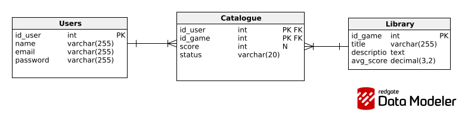

# Web-MyGameList

Servidor web creado por Valentina Bianchi y Maximo Billordo para la materia Programación Web, de la carrera Ingeniería de Sistemas de la UNICEN.

## Descripción

MyGameList es una aplicación para llevar un catálogo de los juegos favoritos de una persona. Para cada juego se guarda un título, una calificación (de 1 a 5 estrellas) y un estado (Por jugar, Jugando, Completado, Platinado).

## Modelo de datos

El esquema de la base de datos (PostgreSQL) está compuesto por tres tablas:

* **Users**: usuarios registrados en la aplicación (id, nombre, email, contraseña).
* **Library**: catálogo global de juegos disponibles (id, título, descripción, calificación promedio).
* **Catalogue**: tabla intermedia que representa la lista personal de cada usuario (qué juego tiene agregado, con qué puntaje y en qué estado).

El esquema completo se encuentra en `db/schema/schema.sql`, y las consultas SQL utilizadas para generar el código de acceso a datos están en `db/queries/queries.sql`.
### Modelo relacional

## Requisitos

* Si no está instalado, usar el siguiente comando para instalar docker-compose: `sudo apt install docker-compose-v2`
* Verificar la instalación con: `docker compose version`

## Cómo ejecutar la aplicación

```bash
cd servidor-web
go run .
```

## Cómo correr los tests

Todo el flujo de testing está automatizado con un `Makefile`, que se apoya en `docker compose` para levantar una base de datos PostgreSQL limpia, generar el código con `sqlc`, compilar el proyecto y correr los tests, sin necesidad de tener PostgreSQL, Go ni `sqlc` instalados en la máquina host (todo corre dentro de contenedores Docker).

Para correr los tests, desde la raíz del proyecto:

```bash
make test
```

Esto ejecuta, en orden:

1. Limpieza de cualquier contenedor o volumen previo (`docker compose down -v`).
2. Construcción de la imagen donde corren los tests (`docker compose build test`).
3. Levantamiento del contenedor de PostgreSQL, esperando a que esté listo para aceptar conexiones (`healthcheck`).
4. Dentro de un contenedor: generación del código con `sqlc generate`, compilación (`go build`) y ejecución de los tests (`go test ./... -v`).
5. Limpieza de los contenedores y volúmenes al finalizar, tanto si los tests pasaron como si fallaron.

